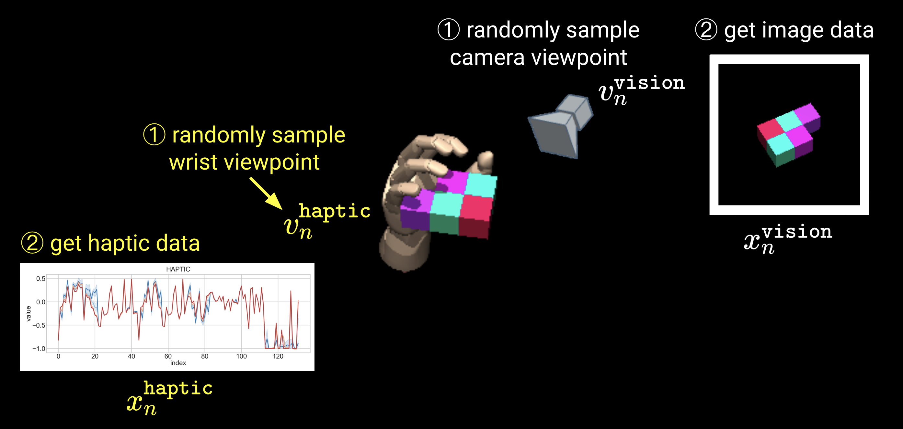
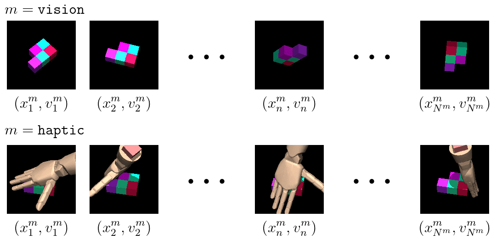

# Multisensory Embodied 3D-Scene Environment (MESE)
Multisensory Embodied 3D-Scene Environment (MESE) introduced in our paper:
> Jae Hyun Lim, Pedro O. Pinheiro, Negar Rostamzadeh, Christopher Pal, Sungjin Ahn, [Neural Multisensory Scene Inference](https://arxiv.org/abs/1910.02344) (2019)


## Introduction
In [our paper](https://arxiv.org/abs/1910.02344), we introduce Multisensory Embodied 3D-Scene Environment (MESE). MESE integrates MuJoCo (Todorov et al., 2012), MuJoCo HAPTIX (Kumar & Todorov, 2015), and the OpenAI gym (Brockman et al., 2016) for 3D scene understanding through multisensory interactions. In particular, from MuJoCo HAPTIX the Johns Hopkins Modular Prosthetic Limb (MPL) (Johannes et al., 2011) is used. The resulting MESE, equipped with vision and proprioceptive sensors, makes itself particularly suitable for tasks related to human-like embodied multisensory learning. For more information, please visit our [project website](https://sites.google.com/view/generative-multisensory-net).  

- Data generation process

  
  
- Example single object multisensory scene in MESE

  


### Structure
- **Scene**: Adopted from [Eslami et al. (2018)](https://science.sciencemag.org/node/711469.full), MESE generates single Shepard-Metzler object per episode. The number of blocks for Shepard-Metzler object can be set (default: 5). Each block of the object (scene) has following class structure.
  ```python
  class Scene(object):
      def __init__(self,
                   images,
                   cameras,
                   proprioceptives,
                   hands,
                   hand_images,
                   sampled_dir_cameras,
                   sampled_dir_hands,
                   env_info,
                   ):
          self.images =              images
          self.cameras =             cameras
          self.proprioceptives =     proprioceptives
          self.hands =               hands
          self.hand_images =         hand_images
          self.sampled_dir_cameras = sampled_dir_cameras
          self.sampled_dir_hands =   sampled_dir_hands
          self.env_info =            env_info
  ```

- **Image**: An RGB camera is defined in the environment for visual input. The position of the camera and its facing direction, i.e. (x, y, z, pitch, yaw) are defined as actions for agents. We refer to a viewpoint as the position and facing direction combined. A list of viewpoints will be saved in `cameras` instance variable. For each viewpoint, a RGB image is generated in `3 × 150 × 150` dimension, and A list of images are saved in `images` variable.

- **Haptic**: For proprioceptive (haptic) sense, the Johns Hopkins Modular Prosthetic Limb (MPL) ([Johannes et al., 2011](http://mindtrans.narod.ru/pdfs/Modular_Prosthetic_Limb.pdf)) is used, which is a part of MuJoCo HAPTIX. The MPL hand model has 13 degrees of freedom to control. MESE adds 5 degrees of freedom, i.e. (x, y, z, pitch, yaw), to control the position and facing direction of the hand’s wrist, similar to camera control.
Given an wrist information, i.e. the aforementioned 5-DoF, a fixed deterministic policy is performed. The hand model generates 132-dimensional observation. List of such observations are stored in `proprioceptives`, corresponding to the wrist, stored in `hands`.


## Download (generated) dataset

[[Link]]() (will be updated soon)


## Getting started (generate data)

### Requirements
[MuJoCo](https://mujoco.org/) (ver 150)  
[openai/mujoco-py](openai-mujoco-py) (commit: `399a22b1384a078f8cd02d10486cff379cdf5985`)  
[openai/gym](https://github.com/lim0606/gym) (modified version)

### Docker installation
Instead of manually installing the aforementioned requirements, you can build docker images described in `docker` folder. The docker images require the license of mujoco to run experiments. Please find [`docker/README.md`](https://github.com/lim0606/test-multisensory-embodied-3D-scene-environment/tree/master/docker) for more details.
```sh
cd docker
cp <PATH TO LINCENCE>/mjkey.txt .
./build-no-cuda.sh
```

## Usage (example)

- Run a docker (interactive) container, which run `xvfb` by default.
  ```sh
  ./docker.sh $PWD
  ```
- In the docker container, run `shepard_metzler_n_parts.py`
  ```sh
  cd /app/projs/multisensory-embodied-3D-scene-environment
  python shepard_metzler_n_parts.py --n-parts 5 --train --n_experiments 2000
  ``` 

## Contact
For questions and comments, feel free to contact [Jae Hyun Lim](mailto:jae.hyun.lim@umontreal.ca).

## License
MIT License

## Reference
```
@article{jaehyun2019gmn,
  title     = {Neural Multisensory Scene Inference},
  author    = {Jae Hyun Lim and
               Pedro O. Pinheiro and
               Negar Rostamzadeh and
               Christopher J. Pal and
               Sungjin Ahn},
  journal   = {arXiv preprint arXiv:1910.02344},
  year      = {2019},
}
```
